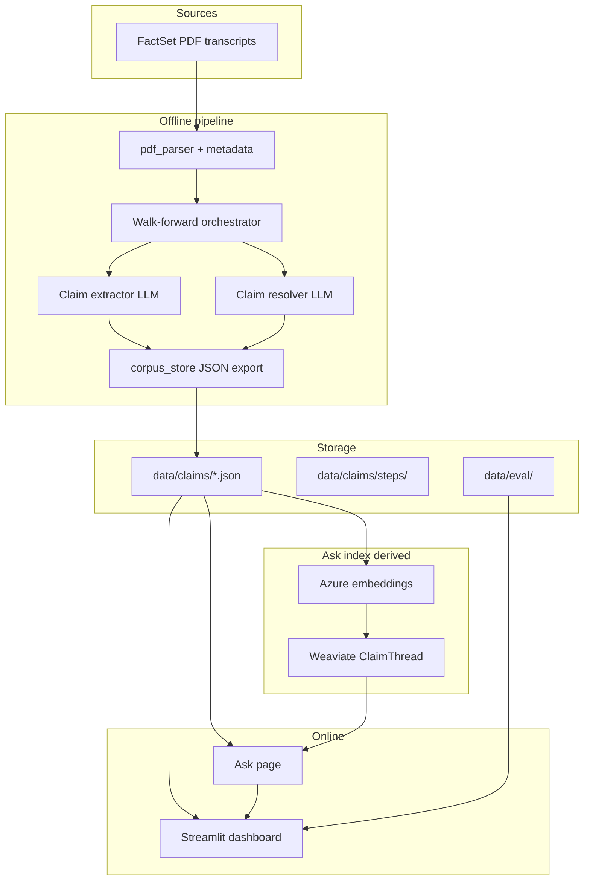
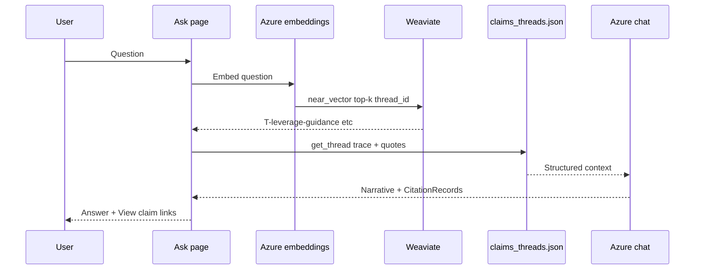

# ClaimWatch architecture

## Overview

ClaimWatch has five concerns:

1. **Offline pipeline** — Process transcripts in chronological order; extract forward-looking claims; resolve prior open claims using only later in-corpus evidence.
2. **Corpus store** — Versioned JSON (claims, threads, step snapshots) committed to git — **source of truth**.
3. **Ask index (derived)** — Thread vectors in **Weaviate Cloud** for semantic search (Azure embeddings); rebuilt from `claims_threads.json`, not authoritative over JSON.
4. **Online interface** — Streamlit dashboard over JSON plus **Ask** (NL questions with citations).
5. **Quality eval** (optional) — Golden labels in `data/eval/gold/` compared to pipeline output; consolidated in `data/eval/results.json`.

## Walk-forward orchestrator

For each transcript **T** in date order:

| Step | Action |
|------|--------|
| 0 | **Auto-stale** — Open claims past `timeframe + 120 days` grace → `stale` |
| 1 | **Pass 1 — Extract** — New atomic claims from management discussion + Q&A (LLM) |
| 2 | **Pass 2 — Resolve** — Only claims that were open *before* T; resolver does not invent new claims; new claims from T can appear in `resolved_by` |
| 3 | **Snapshot** — Write per-transcript step under `data/claims/steps/<transcript_id>/` |
| 4 | **Export** — Rolling `claims_made.json`, `claims_with_resolutions.json`, `claims_threads.json` |

Resolution is **in-corpus only**: evidence must appear in a later transcript in the processed set, not external financials.

## Ask — natural language (Weaviate)

Optional **query-time** path (does not change walk-forward truth in JSON):

| Step | Module | Notes |
|------|--------|--------|
| Index build | `src/search/weaviate_threads.py` | `index-threads --reset` embeds ~208 threads, upserts `ClaimThread` |
| Search | same | Cosine on query vector; keyword fallback if Weaviate unset |
| Synthesize | `src/agents/query_agent.py` | Citations must match `claim_id`s in loaded trace |
| UI | `app/dashboard.py` `page_ask` | Metrics, reindex buttons, retrieval table, deep links |

**Env:** `WEAVIATE_URL`, `WEAVIATE_API_KEY`, `AZURE_EMBEDDING_DEPLOYMENT` (plus existing Azure chat vars for synthesis).

## Dashboard pages

| Page | Data source |
|------|-------------|
| Overview | JSON corpus aggregates |
| **Ask** | Weaviate search + `claims_threads.json` + Azure LLM |
| Pipeline Eval | `data/eval/results.json` |
| Claims Explorer | `claims_with_resolutions.json` |
| Claim Detail | Claim + PDF citation + transcript excerpt |
| Threads | `claims_threads.json` + trace |
| Resolution Analytics | Status timelines, time-to-resolve |
| Speakers | Speaker-level stats |
| Architecture | Embedded `docs/claimwatch-architecture.html` |
| LLM Cost | Heuristic cost model |

## Golden-set evaluation

See [evaluation.md](evaluation.md). Commands: `eval`, `eval-extract`, `eval-resolve`.

## Key modules

| Path | Role |
|------|------|
| `src/ingestion/pdf_parser.py` | FactSet PDF → speaker turns |
| `src/ingestion/parsed_loader.py` | Load `data/parsed/*.json` |
| `src/llm/azure.py` | Azure OpenAI structured chat (extract, resolve, eval judge) |
| `src/agents/claim_extractor.py` | Pass 1 structured extraction |
| `src/agents/claim_resolver.py` | Pass 2 resolution |
| `src/pipeline/orchestrator.py` | Chronological loop |
| `src/pipeline/claim_trace.py` | Thread traces from step diffs |
| `src/eval/*` | Gold matching + LLM judge |
| `src/search/weaviate_threads.py` | Weaviate `ClaimThread` index + search |
| `src/search/thread_embeddings.py` | Search facade (Weaviate or keyword fallback) |
| `src/agents/query_agent.py` | Ask synthesis + citations |
| `src/llm/azure.py` | Azure chat + embeddings |
| `app/dashboard.py` | Streamlit UI |
