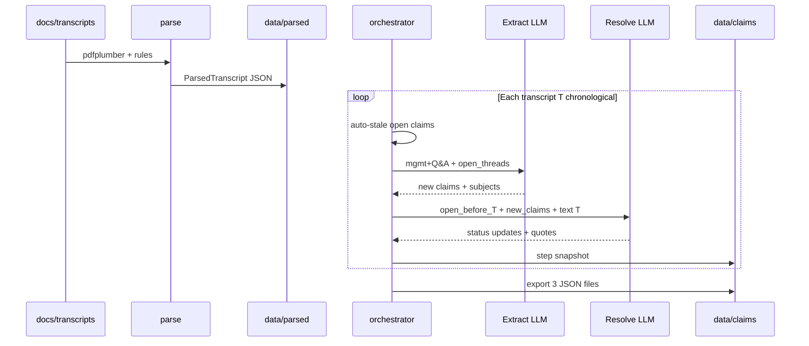

# ClaimWatch — Exhaustive System Documentation

**Purpose:** Single reference covering every design choice, data artifact, pipeline step, model field, eval metric, dashboard surface, cost model, limitation, and code path. Nothing omitted by design.

**Version:** JSON corpus (source of truth) + optional **Ask** over Weaviate Cloud (derived thread index).

**Companion files:** [architecture.md](architecture.md) · [data-and-parsing.md](data-and-parsing.md) · [taxonomy.md](taxonomy.md) · [evaluation.md](evaluation.md) · [tradeoffs.md](tradeoffs.md) · [improvements.md](improvements.md) · [claimwatch-architecture.html](claimwatch-architecture.html)

---

## Table of contents

1. [Glossary](#1-glossary)
2. [Take-home brief alignment](#2-take-home-brief-alignment)
3. [Why this system is good](#3-why-this-system-is-good)
4. [What we explicitly did not build](#4-what-we-explicitly-did-not-build)
5. [Repository layout](#5-repository-layout)
6. [Dependencies and runtime](#6-dependencies-and-runtime)
7. [Environment variables](#7-environment-variables)
8. [Source corpus (PDFs)](#8-source-corpus-pdfs)
9. [Stage A — Parse (no LLM)](#9-stage-a--parse-no-llm)
10. [Speaker turns vs vector chunks](#10-speaker-turns-vs-vector-chunks)
11. [Parsed JSON — every field](#11-parsed-json--every-field)
12. [Stage B — Walk-forward orchestrator](#12-stage-b--walk-forward-orchestrator)
13. [Step 0 — Auto-stale](#13-step-0--auto-stale)
14. [Step 1 — Extract (LLM)](#14-step-1--extract-llm)
15. [Step 2 — Resolve (LLM)](#15-step-2--resolve-llm)
16. [Resolver pre-filter (Python)](#16-resolver-pre-filter-python)
17. [Pipeline state and claim IDs](#17-pipeline-state-and-claim-ids)
18. [Threads — design, assignment, trace](#18-threads--design-assignment-trace)
19. [Corpus JSON files — every field](#19-corpus-json-files--every-field)
20. [Step snapshots](#20-step-snapshots)
21. [Taxonomy and status machine](#21-taxonomy-and-status-machine)
22. [Golden-set evaluation](#22-golden-set-evaluation)
23. [Azure LLM layer](#23-azure-llm-layer)
24. [LLM cost model](#24-llm-cost-model)
25. [Streamlit dashboard — every page](#25-streamlit-dashboard--every-page)
26. [CLI — every command and flag](#26-cli--every-command-and-flag)
27. [Stats and sidecar files](#27-stats-and-sidecar-files)
28. [Deployment](#28-deployment)
29. [Scaling](#29-scaling)
30. [Known limitations and roadmap](#30-known-limitations-and-roadmap)
31. [Interview talking points](#31-interview-talking-points)
32. [Ask — natural language (Weaviate)](#32-ask--natural-language-weaviate)

---

## 1. Glossary

| Term | Meaning |
|------|---------|
| **Claim** | One atomic forward-looking management utterance from one transcript, stored as `RKW-NNN`. |
| **Thread** | Group of related claims sharing a storyline (`thread_id` like `T-fy2021-revenue-growth`). |
| **Walk-forward** | Process transcripts in chronological order; at transcript T only use evidence from T and earlier. |
| **Open** | Claim not yet given a terminal resolution status in the simulation. |
| **Terminal status** | `confirmed`, `failed`, `partial`, `revised`, `unresolvable`, `stale` (not `open`). |
| **In-corpus** | Resolution uses only later transcript text in this repo — not 10-K or market data. |
| **Pass 1** | Extract new claims from transcript T. |
| **Pass 2** | Resolve claims that were open **before** T using text of T. |
| **Speaker turn** | One speaker block in a PDF section (split on dotted lines) — **not** an embedding chunk. |
| **Step snapshot** | `data/claims/steps/<transcript_id>/` — corpus state immediately after processing that transcript. |
| **Gold** | Hand/LLM-curated labels in `data/eval/gold/` for transcripts 00–04. |
| **SUT** | System under test — Azure pipeline on `data/parsed/`. |
| **Stage A eval** | Deterministic fuzzy matcher (quote + paraphrase). |
| **Stage B eval** | Azure GPT-4o LLM judge on matched pairs. |
| **Ask** | NL question → Weaviate thread search → trace from JSON → LLM answer with citations. |
| **ClaimThread** | Weaviate collection holding one vector per guidance thread (~208). |

---

## 2. Take-home brief alignment

**Input:** ~30 Rockwool FactSet transcripts (we have **31**).

**Required capabilities:**

| Requirement | How ClaimWatch satisfies it |
|-------------|----------------------------|
| Extract forward-looking management claims | Pass 1 LLM + rules in `claim_extractor.py` |
| Track across subsequent transcripts | Pass 2 + `thread_id` + `claims_threads.json` trace |
| Materialized / partial / didn't / unresolvable | Corpus statuses mapped in [taxonomy.md](taxonomy.md) |
| Walk-forward chronological processing | `orchestrator.py` sorted parsed JSON paths |
| State across time | `PipelineState` + per-step snapshots |
| Traceable evidence | `quote`, `evidence_quote`, PDF citation in dashboard |
| Discuss taxonomy, eval, failures, scale | Documented here + eval JSON + tradeoffs |

**Explicitly optional in brief:** External data sources — **not implemented** (in-corpus only).

---

## 3. Why this system is good

1. **Analyst-faithful simulation** — No hindsight; resolver cannot read future calls when judging past claims.
2. **Audit trail** — Verbatim quotes; parse layer preserves FactSet speaker boundaries; step snapshots replay history.
3. **Separation of concerns** — Deterministic parse → stochastic LLM judgment → deterministic trace/export.
4. **Git-native corpus** — `data/claims/` diffable; dashboard needs no DB sync.
5. **Low ops demo** — `git pull` + `dashboard`; Azure only for pipeline refresh.
6. **Defensible eval** — Cross-family gold (Claude-labelled) vs Azure SUT; matcher + judge reported separately.
7. **Cost transparency** — Two LLM calls per transcript; LLM Cost page with 30k/300k/3M extrapolation.
8. **Honest boundaries** — Tradeoffs and limitations documented; no fake “verified vs financials”.

---

## 4. What we explicitly did not build

Removed or never shipped (do not describe as missing bugs):

| Feature | Why removed / deferred |
|---------|----------------------|
| Full hybrid FTS + claim-level vector index | Thread-only Ask index shipped first |
| In-memory vector index | Weaviate Cloud for Ask |
| Transcript-chunk RAG at query time | Thread trace + citations from JSON |
| Forecast calculator | Resolution analytics only |
| Per-op CostLog in DB | Console tokens + cost estimates |
| Docker bundle as default | Streamlit Cloud + local uv |
| External filing verification | Out of scope for take-home |
| `restore` / `check` CLI | Stubs — not implemented |

Old [plan.md](../plan.md) at repo root describes a larger Weaviate schema (claims, chunks) — **Ask v1** uses only `ClaimThread`. This guide is authoritative for what is shipped.

---

## 5. Repository layout

```
claimwatch/
  app/
    dashboard.py              # Streamlit UI (Ask + analytics pages)
  src/
    main.py                   # CLI entry
    agents/
      claim_extractor.py      # Pass 1
      claim_resolver.py       # Pass 2
      query_agent.py          # Ask synthesis
    search/
      weaviate_threads.py     # Weaviate ClaimThread index
      thread_embeddings.py    # Search facade
      models.py               # ThreadSearchHit
      speaker_filter.py       # mgmt turn detection for LLM input
    analytics/
      corpus_loader.py        # load JSON bundle for dashboard
      corpus_analytics.py     # aggregates, timelines
      cost_estimate.py        # LLM cost heuristics
      pdf_citation.py         # PDF page locate + render
      status_mapping.py       # status → interview labels
    eval/
      matcher.py              # Stage A pairing
      extraction_eval.py
      resolution_eval.py
      llm_judge.py            # Stage B
      gold_loader.py
      summary.py
    ingestion/
      pdf_parser.py
      parsed_loader.py
      transcript_metadata.py
    llm/
      azure.py                # structured chat
    models/
      schema.py               # ParsedTranscript, enums (ingest)
      corpus.py               # ClaimMade, threads (pipeline output)
    pipeline/
      orchestrator.py
      corpus_store.py
      claim_staleness.py
      claim_trace.py
    stats/
      reports.py
      extract_compare.py
    store/
      claims.py               # export helpers
  data/
    parsed/                   # 31 JSON (committed)
    claims/                   # corpus + steps/ (committed)
    eval/                     # gold + results.json
    stats/                    # parse/extract/eval reports
  docs/
    transcripts/              # PDFs LOCAL ONLY (not in git)
    *.md                      # documentation
  .env.example
  pyproject.toml
  requirements.txt            # Streamlit Cloud
  .streamlit/config.toml
```

---

## 6. Dependencies and runtime

**Python:** `>=3.11` ([pyproject.toml](../pyproject.toml))

**Core packages:**

| Package | Role |
|---------|------|
| `openai` | Azure OpenAI client |
| `pydantic` | Schemas + structured outputs |
| `pdfplumber` | PDF text extraction |
| `pandas` | Dashboard tables |
| `plotly` | Charts |
| `streamlit` | Dashboard |
| `weaviate-client` | Ask — Weaviate Cloud |
| `python-dotenv` | `.env` loading |
| `rich` | CLI tables |

**Install:** `uv sync` (recommended) or `pip install -r requirements.txt`

**Note:** `requirements.txt` should match `pyproject.toml` (includes `weaviate-client` for Ask).

---

## 7. Environment variables

| Variable | Required | Purpose |
|----------|----------|---------|
| `AZURE_OPENAI_ENDPOINT` | For pipeline/eval | Azure resource URL |
| `AZURE_OPENAI_API_KEY` | For pipeline/eval | API key |
| `AZURE_OPENAI_API_VERSION` | Optional | Default `2024-12-01-preview` |
| `AZURE_CHAT_API_VERSION` | Optional | Chat API version, default `2025-01-01-preview` |
| `AZURE_CHAT_TEMPERATURE` | Optional | Default `0` |
| `AZURE_CHAT_SEED` | Optional | Integer seed when set (reproducibility) |
| `AZURE_DEPLOYMENT_NAME` | Optional | Default deployment name |
| `AZURE_EXTRACTION_DEPLOYMENT` | Optional | Extract/resolve deployment, defaults to `AZURE_DEPLOYMENT_NAME` or `gpt-4o-mini` |
| `AZURE_MINI_INPUT_USD_PER_1M` | Optional | Cost dashboard pricing override |
| `AZURE_MINI_OUTPUT_USD_PER_1M` | Optional | Cost dashboard pricing override |
| `TRANSCRIPTS_DIR` | Optional | Default `docs/transcripts` |
| `PARSED_DIR` | Optional | Default `data/parsed` |
| `CLAIMWATCH_DATA_DIR` | Optional | Default `data/claims` |
| `WEAVIATE_URL` | For Ask | Weaviate Cloud cluster URL |
| `WEAVIATE_API_KEY` | For Ask | Weaviate API key |
| `AZURE_EMBEDDING_DEPLOYMENT` | For Ask index + query | Default `text-embedding-3-small` |
| `AZURE_EMBEDDING_DIMENSIONS` | Optional | Default `1536` |

**Dashboard browse (Explorer, Threads, …):** No Azure/Weaviate required if `data/claims/` is present.

**Ask page / `ask` CLI:** Requires Weaviate + Azure embeddings + Azure chat. Run `index-threads` after corpus changes.

**Never commit `.env`.**

---

## 8. Source corpus (PDFs)

| Attribute | Value |
|-----------|--------|
| Provider | FactSet CallStreet |
| Company | Rockwool International A/S |
| Count | **31** files |
| Date range | 2021-05-20 → 2026-04-15 (AGM) |
| Event types | `earnings_call`, `agm`, `esg_meeting`, `extraordinary_meeting`, `analyst_meeting` |
| Location | `docs/transcripts/*.pdf` |
| In git | **No** — licence and size |

**Filename pattern:** `{index}_{YYYY-MM-DD}_{event_slug}.pdf`  
→ `transcript_id` = filename without `.pdf`.

**Chronological order:** CLI sorts by metadata `transcript_date` from PDF header (filename fallback).

**Key management speakers (examples):** Jens Birgersson (CEO), Kim Junge Andersen (CFO), Anthony Abbotts, etc.

---

## 9. Stage A — Parse (no LLM)

**CLI:** `uv run python -m src.main parse --all`  
**Module:** `src/ingestion/pdf_parser.py`, `transcript_metadata.py`  
**Output:** `data/parsed/<transcript_id>.json`  
**Summary:** `data/parse_summary.json`, `data/stats/parse_summary.txt`

### 9.1 Why parse before LLM?

- FactSet PDFs have **repeatable structure** (section headers, dotted separators).
- Rules give **stable verbatim quotes** for eval quote-locate and audit.
- Re-running extract/resolve does not require re-OCR.
- Metadata (date, quarter) from PDF header is more reliable than filename alone.

### 9.2 FactSet layout processed

```
[Skipped] Cover, participant lists
[Parsed]  MANAGEMENT DISCUSSION SECTION → turns + mgmt_discussion_text
[Parsed]  QUESTION AND ANSWER SECTION → turns + qa_text
[Skipped] Disclaimer from "The information herein is based on"
```

### 9.3 Parse algorithm (step by step)

1. **Open PDF** with `pdfplumber`; extract text per page.
2. **Strip boilerplate** per page: FactSet header block, copyright, `1-877-FACTSET`, page numbers, repeated title lines (`_FACTSET_HEADER_BLOCK_RE`, `_BOILERPLATE_LINE_RE`).
3. **Locate sections** via regex `_MGMT_HEADER_RE`, `_QA_HEADER_RE`.
4. **Split speaker turns** on lines matching `.{20,}` (dotted separator).
5. **Parse speaker line** into `speaker_name` + `speaker_role`.
6. **Set `is_management`** if role matches keywords (CEO, CFO, President, …) in `pdf_parser._MANAGEMENT_ROLE_KEYWORDS`.
7. **Concatenate** section texts into `mgmt_discussion_text` and `qa_text`.
8. **Extract metadata** via `extract_metadata(path)` → date, `event_type`, quarter, year.
9. **Validate** with Pydantic `ParsedTranscript`; write JSON.

### 9.4 Parse CLI modes

| Command | Behavior |
|---------|----------|
| `parse 0` | Parse transcript index 0 from `list` |
| `parse Q1 2021` | Parse filename substring match |
| `parse --all` | All PDFs in `TRANSCRIPTS_DIR` |

### 9.5 Parse errors

Failed PDFs recorded in `parse_summary.json` `errors` array; others still written.

---

## 10. Speaker turns vs vector chunks

**We do not chunk for embeddings.** “Chunk” in this project means:

| Unit | Description |
|------|-------------|
| **Speaker turn** | `SpeakerTurn` — one speaker block, `chunk_index` within section |
| **Section text** | Full mgmt or Q&A string for LLM when turns unavailable |
| **Atomic claim** | One falsifiable forward-looking hook (Pass 1 output row) |

**Extractor input format** (`_format_transcript_text`):

```
[speaker_name | speaker_role | mgmt_discussion|qa]
<turn text>

---

[next turn]
```

**Management filter** (`speaker_filter.is_management_turn`):

- Uses `turn.is_management` from parser **plus** name heuristics (birgersson, junge andersen, abbotts, …) and role keywords.
- Excludes `operator`.
- Excludes roles containing `analyst`.

**Fallback:** If no management turns found, concatenates `mgmt_discussion_text` + `qa_text`.

**Q&A inclusion:** `include_qa=True` by default in pipeline — management answers extracted, not analyst questions.

---

## 11. Parsed JSON — every field

### 11.1 `TranscriptMetadata`

| Field | Type | Meaning |
|-------|------|---------|
| `filename` | str | Original PDF name |
| `transcript_date` | date | Call date |
| `event_type` | enum | `earnings_call`, `agm`, `esg_meeting`, … |
| `quarter` | str? | `Q1`–`Q4` when applicable |
| `year` | int | Fiscal/call year |
| `company` | str | Default `ROCKWOOL` |

### 11.2 `SpeakerTurn`

| Field | Type | Meaning |
|-------|------|---------|
| `speaker_name` | str | As in PDF |
| `speaker_role` | str | Title line |
| `is_management` | bool | Parser keyword flag |
| `text` | str | Turn body |
| `section` | enum | `mgmt_discussion` or `qa` |
| `chunk_index` | int | Order within section |

### 11.3 `ParsedTranscript`

| Field | Type | Meaning |
|-------|------|---------|
| `metadata` | object | Above |
| `speaker_turns` | list | All turns |
| `mgmt_discussion_text` | str | Full mgmt section text |
| `qa_text` | str | Full Q&A text |
| `total_pages` | int? | Page count |

**Loader:** `load_parsed_transcript(path)` in `parsed_loader.py`.

---

## 12. Stage B — Walk-forward orchestrator

**Module:** `src/pipeline/orchestrator.py` — `run_walk_forward()`  
**CLI:** `uv run python -m src.main run --all`

### 12.1 Input ordering

`parsed_paths` sorted chronologically (from `data/parsed/*.json` filenames + dates).

### 12.2 Per-transcript loop (exact order)

For each `json_path` with `tid = json_path.stem`:

1. Load `ParsedTranscript`.
2. Count `open_before_count = len(state.open_claims())`.
3. **Step 0:** `expire_stale_open_claims(..., as_of=meta.transcript_date, grace_days=120)`.
4. Record `claim_ids_before_extract` = all claim IDs now in state.
5. **Step 1:** `extract_claims_from_transcript(parsed, tid, open_threads=state.open_threads_summary())`.
6. For each extracted item → `state.add_claim(...)` (assigns `RKW-NNN`, thread, resolution `open`).
7. **Step 2** (unless `extract_only`):
   - Build `open_from_before` = claims in `claim_ids_before_extract` still `open`.
   - If empty → skip resolver, still snapshot.
   - `filter_claims_for_resolver(open_from_before, transcript_text, new_claims=...)`.
   - `resolve_open_claims(fed, parsed, tid, new_claims=new_claims)`.
   - Apply each update via `state.apply_resolution_update(...)`.
8. **Snapshot:** `state.export_step_snapshot(tid, corpus_label)`.
9. Log cumulative claims/threads and timing/tokens.

### 12.3 End of run

`state.export_three_files(corpus_label)` → root `data/claims/*.json`.

### 12.4 `run` CLI flags

| Flag | Effect |
|------|--------|
| `--all` | All parsed JSON files |
| `--limit N` | First N chronologically |
| `--extract-only` | Skip Pass 2 (no resolution LLM) |
| `--eval` | After run, run full `eval` |
| `--eval-extract` | After run, extraction eval only |

### 12.5 `extract_only` use case

Faster iteration on Pass 1 prompts; all claims stay `open` unless auto-stale applies later when you run full pipeline.

---

## 13. Step 0 — Auto-stale

**Module:** `src/pipeline/claim_staleness.py`  
**Constant:** `DEFAULT_GRACE_DAYS = 120`

### 13.1 When stale fires

For each claim with `resolution.status == "open"`:

1. Parse `timeframe` string → `end_date` via `_parse_timeframe_end()`.
2. If `end_date` is `None` (e.g. `near-term`, `ongoing`) → **never** auto-stale.
3. If `as_of.toordinal() > end_date.toordinal() + grace_days` → set `status = stale`, note `Auto-stale: horizon {timeframe} ended before {as_of}`.

### 13.2 Timeframe parsing rules (`_parse_timeframe_end`)

| Pattern | End date |
|---------|----------|
| `FY2024`, `fy 2024` | 2024-12-31 |
| `Q1 2024`, `q2 2023` | Last day of quarter month (Q×3) |
| `H1 2024`, `h2 2023` | 2024-06-30 or 2024-12-30 |
| Bare `2024` | 2024-12-31 |
| `early 2024` | 2024-06-30 |
| `late 2024` | 2024-12-31 |
| `next year` (relative to `date_made`) | Dec 31 of claim year + 1 |
| `near-term`, `multi-year`, `future`, `ongoing` | No stale (returns None) |

### 13.3 Interview framing

Auto-stale models **“quietly dropped”** guidance never revisited — blunt but prevents infinite `open` backlog.

---

## 14. Step 1 — Extract (LLM)

**Module:** `src/agents/claim_extractor.py`  
**Azure:** `chat_structured(..., response_model=ExtractionBatch)`  
**Deployment:** `get_extraction_deployment()` → `AZURE_EXTRACTION_DEPLOYMENT` or `gpt-4o-mini`

### 14.1 System prompt (summary of rules)

Full text in `SYSTEM_PROMPT` constant:

- **Scope:** Management prepared remarks + management Q&A answers.
- **Include:** Guidance, targets, expectations, commitments, plans, milestones; `falsifiable=partial` when partial; `falsifiable=N` for untestable strategic statements if kept.
- **Exclude:** Past-only results, vague macro, filler, analyst questions.
- **Atomicity:** One claim per falsifiable hook; split multi-metric sentences.
- **Reaffirmation:** Still emit new claim; threading via `subject` / `thread_subject_hint`.
- **Q&A:** Quote management only; `source_section=qa`.
- **Fields:** `subject`, `target_value`, `falsifiable`, `hedging_level` — do not upgrade hedge in `normalized_claim`.
- **`original_text`:** Must be verbatim substring of provided text.

### 14.2 User prompt contents

- `transcript_id`, `transcript_date`, `event_type`, `quarter`, `year`
- Optional **open threads** block (up to **40** threads): `thread_id`, `subject`, `last_target_value`
- Full management speech text (formatted turns)

### 14.3 `ExtractedClaimItem` fields

| Field | Maps to corpus |
|-------|----------------|
| `original_text` | `quote` |
| `normalized_claim` | `paraphrase` |
| `claim_type` | `category` (enum value string) |
| `claim_subtype` | used in legacy `Claim` export only |
| `hedging_level` | `hedge_level` via `_hedge_to_corpus()` |
| `time_horizon` | `timeframe` |
| `speaker_name` | `speaker` |
| `source_section` | `source_section` |
| `subject` | `subject` + threading |
| `target_value` | `target_value` |
| `falsifiable` | `falsifiable` (`Y`/`partial`/`N`) |
| `thread_subject_hint` | `assign_thread(subject, hint)` |
| `metric`, `value`, `unit`, `direction` | optional quantitative (stats export) |
| `notes` | `notes` |

### 14.4 Hedging mapping (`_hedge_to_corpus`)

| Extractor `HedgingLevel` | Corpus `hedge_level` |
|--------------------------|----------------------|
| `hard` | `firm` |
| `soft` | `soft` |
| `conditional` | `moderate` |
| `aspirational` | `soft` |
| `unfalsifiable` | `soft` |

### 14.5 `ClaimType` enum (category)

- `financial_guidance`
- `capex_capacity`
- `market_outlook`
- `strategic_intent`
- `sustainability`
- `operational`

### 14.6 Thread assignment at add_claim time

```text
if thread_subject_hint:
    thread_id = assign_thread(subject, thread_subject_hint)
else:
    thread_id = assign_thread(subject)  # inside add_claim if None
```

`assign_thread`: match `(hint or subject).lower()` to existing `thread.subject.lower()`; else new `T-{slug}`.

### 14.7 Usage returned

`usage` dict: `model`, `tokens_in`, `tokens_out`, `deployment`, `claims_count`.

---

## 15. Step 2 — Resolve (LLM)

**Module:** `src/agents/claim_resolver.py`

### 15.1 Resolver system prompt (rules)

- Use **only** new transcript + provided claim lists.
- **Do not** create new claims.
- Update only `OPEN_CLAIMS_FROM_BEFORE`.
- Status definitions: `confirmed`, `revised`, `failed`, `partial`, `open`, `unresolvable`.
- **`revised`:** must set `resolved_by_claim_id` to an id in `NEW_CLAIMS_THIS_STEP`.
- **`confirmed`:** may leave `resolved_by` null if no new claim row.
- Evidence quotes **verbatim** from new transcript.

### 15.2 User prompt blocks

1. `OPEN_CLAIMS_FROM_BEFORE` — id, thread, date, subject, target, hedge, paraphrase snippet.
2. `NEW_CLAIMS_THIS_STEP` — ids from Pass 1 on this transcript (for `revised` links).
3. `NEW TRANSCRIPT TEXT` — formatted mgmt+Q&A (truncated at **90,000** chars).

### 15.3 `ResolutionUpdateItem`

| Field | Applied to `ClaimResolution` |
|-------|------------------------------|
| `claim_id` | which claim |
| `status` | new status |
| `resolved_by_claim_id` | appended to `resolved_by[]` if valid |
| `evidence_quote` | `evidence_quote` |
| `notes` | `resolution_notes` |

### 15.4 Validation

If `resolved_by_claim_id` not in `new_ids` from this step → cleared with note appended (prevents hallucinated ids).

### 15.5 `apply_resolution_update` behavior

- Sets `status`.
- On first transition from `open` to non-open: sets `resolved_at_date`, `resolved_at_transcript` if provided.
- Appends to `resolved_by` list.
- Overwrites `evidence_quote` / `resolution_notes` when provided.

### 15.6 Critical walk-forward rule

**`open_from_before`** = claims whose IDs existed **before** Pass 1 on this transcript and are still `open`.  
Claims **created** in Pass 1 on T are **not** resolved using T in the same iteration (they start `open`).

---

## 16. Resolver pre-filter (Python)

**Function:** `filter_claims_for_resolver()`  
**Cap:** `max_claims=35` (matches cost model `_MAX_FED_OPEN`)

### 16.1 Scoring (per open claim)

| Signal | Points |
|--------|--------|
| Same `thread_id` as any new claim this step | +10 |
| Each subject token (len>3) found in transcript text | +2 (up to 8 tokens) |
| Target value token in text | +1 |

### 16.2 Selection

- Include claims with `score > 0`, or all if `len(open_claims) <= max_claims`.
- Sort by score descending, then take top **35**.
- If no scores, take first 35 by sort order.

**Why:** Context window and cost control when hundreds of open claims exist at scale.

---

## 17. Pipeline state and claim IDs

**Class:** `PipelineState` in `corpus_store.py`

| State field | Purpose |
|-------------|---------|
| `claims` | list of `ClaimMade` |
| `resolutions` | dict `claim_id` → `ClaimResolution` |
| `threads` | dict `thread_id` → `ClaimThread` |
| `_counter` | monotonic `RKW-001`, `RKW-002`, … |

**`open_claims()`:** resolution missing or `status == "open"`.

**Claim IDs:** Sequential `RKW-{n:03d}` for entire run (not reset per transcript).

---

## 18. Threads — design, assignment, trace

### 18.1 Purpose

- Analyst view: **storyline** over time.
- Extractor context: prior topics still open.
- Resolver filter: pull related open claims when new claim shares `thread_id`.

### 18.2 Not a third LLM

| Component | LLM? |
|-----------|------|
| `subject`, `thread_subject_hint` | Yes (extractor) |
| `thread_id` assignment | No (Python string match + slug) |
| `evolution`, `trace` | No (step snapshot diffs) |

### 18.3 `thread_id` slug algorithm

```python
base = slugify(subject)[:48]  # lowercase, non-alnum → hyphen
tid = f"T-{base}"  # or T-{base}-2 if collision
```

### 18.4 `evolution` vs `trace`

| Array | Content |
|-------|---------|
| `evolution` | One entry per claim at utterance date + `status_after_this_utterance` at that transcript |
| `trace` | Merged chronological `uttered` + `status_changed` for all claims in thread |

### 18.5 `build_claim_trace_events` logic

For each step snapshot in order:

1. Find claim row in snapshot.
2. First sighting → `event=uttered`, `status=open`, speaker from claim.
3. If status ≠ previous → `event=status_changed` with evidence from resolution block.

### 18.6 `rebuild-trace` CLI

Reloads corpus from JSON into `PipelineState`, calls `rebuild_threads()` using `data/claims/steps/`, re-exports three files. **No LLM.**

### 18.7 Example thread (from corpus)

`T-west-virginia-factory-startup`: `RKW-002` uttered Q1 2021 → `revised` at ESG with `resolved_by: RKW-010` → `RKW-021` uttered Q2 → `confirmed` Q4 2022 with evidence quote.

### 18.8 Thread accuracy limits

- Duplicate subjects → split threads.
- Inconsistent hints → orphan claims in wrong thread.
- **Improvements:** normalize subject, fuzzy merge, link via `resolved_by` ([improvements.md](improvements.md)).

---

## 19. Corpus JSON files — every field

### 19.1 `claims_made.json`

| Top-level | Meaning |
|-----------|---------|
| `schema_version` | `"1.0"` |
| `corpus` | Label string |
| `total_claims` | Count |
| `claims[]` | `ClaimMade` objects |

**`ClaimMade` fields:** `claim_id`, `thread_id`, `source_doc`, `source_section`, `date_made`, `speaker`, `quote`, `paraphrase`, `category`, `subject`, `timeframe`, `target_value`, `hedge_level`, `falsifiable`, `notes`.

### 19.2 `claims_with_resolutions.json`

Same claims plus:

**`resolution`:** `status`, `resolved_by[]`, `evidence_quote`, `resolution_notes`, `resolved_at_date`, `resolved_at_transcript`.

### 19.3 `claims_threads.json`

| Top-level | Meaning |
|-----------|---------|
| `total_threads` | 208 |
| `threads[]` | `ClaimThread` objects |

**`ClaimThread`:** `thread_id`, `subject`, `category`, `n_claims`, `first_date`, `last_date`, `first_said_date`, `resolved_at_date`, `resolved_at_transcript`, `final_status`, `claim_ids[]`, `evolution[]`, `trace[]`.

**`ThreadTraceEvent`:** `event`, `claim_id`, `date`, `transcript_id`, `speaker`, `status`, `target_value`, `hedge_level`, `evidence_quote`, `resolution_notes`, `resolved_by_claim_ids[]`.

### 19.4 Reference corpus scale

| Metric | Value |
|--------|-------|
| Transcripts | 31 |
| Claims | 373 |
| Threads | 208 |
| Open (after full run) | ~140 |
| Confirmed | ~75 |

(Exact counts drift when pipeline re-run.)

---

## 20. Step snapshots

**Path:** `data/claims/steps/<transcript_id>/`

**Files (same schema as root):**

- `claims_made.json`
- `claims_with_resolutions.json`
- `claims_threads.json`

**Purpose:**

- Audit: corpus state **as of** after that meeting.
- Rebuild traces without re-running LLM.
- Eval resolution checkpoint uses snapshot after transcript `04`.

---

## 21. Taxonomy and status machine

See [taxonomy.md](taxonomy.md).

| Corpus | Interview label |
|--------|-----------------|
| `confirmed` | Materialized |
| `partial` | Partially materialized |
| `failed` | Didn't materialize |
| `unresolvable` | Remains unresolvable |
| `open` | Pending (simulation) |
| `revised` | Superseded (see successor) |
| `stale` | Quietly dropped |
| `n/a` | N/A |

**`falsifiable`:** `Y` | `partial` | `N`  
**`hedge_level`:** `firm` | `moderate` | `soft`

---

## 22. Golden-set evaluation

Full detail: [evaluation.md](evaluation.md).

### 22.1 Scope

- Transcripts **`00`–`04`** only.
- **54** gold extraction claims.
- Resolution checkpoint: after transcript **`04_2022-02-10_earnings_call_Q4`**.

### 22.2 Roles

| Role | Model | Reads |
|------|-------|-------|
| SUT | Azure gpt-4o-mini | `data/parsed/` |
| Gold labeller | Claude (curated) | `data/parsed/` only |
| Stage B judge | Azure GPT-4o | Matched pairs + parsed context |
| Human | You | Gold files, `reviewed=true` |

### 22.3 Stage A matcher

- `score = max(sim(quote), sim(paraphrase))` using `difflib.SequenceMatcher` on normalized text.
- Match if `score >= 0.88` (default `--similarity`).
- Greedy, gold-first; one prediction per gold max.

**Extraction pool:** predictions filtered to same `source_doc` as gold row.  
**Resolution pool:** all predictions in checkpoint snapshot.

### 22.4 Extraction metrics

Precision, recall, F1, quote locate %, over-extraction rate, tag agreement (`category`, `hedge_level`, `falsifiable`).

**Stage B (extraction):** `reproduces_gold`, `contextually_relevant`, `quote_supported`.

### 22.5 Resolution metrics

Status accuracy, resolved-at accuracy, evidence quote locate %, evidence overlap %, revised-link accuracy, false open %, false close %, confusion matrix.

**Stage B (resolution):** `reproduces_gold_status`, `evidence_relevant`, `resolution_contextually_sound`.

### 22.6 Outputs

| File | Command |
|------|---------|
| `data/eval/results.json` | `eval` |
| `data/eval/results.txt` | `eval` |
| `data/stats/extraction_eval_report.txt` | `eval-extract` |
| `data/stats/resolution_eval_report.txt` | `eval-resolve` |

### 22.7 Typical workflow

```powershell
uv run python -m src.main run --limit 5
uv run python -m src.main eval
```

`run --limit 5` aligns with gold transcript window.

### 22.8 Out of scope for v1 eval

- Per-step resolution gold (only checkpoint after 04).
- Full 31-transcript gold (too costly to label).

---

## 23. Azure LLM layer

**Module:** `src/llm/azure.py`

- Client: `AzureOpenAI` cached via `get_azure_chat_client()`.
- API: `client.beta.chat.completions.parse` with Pydantic `response_format`.
- **Temperature:** from env, default 0.
- **Seed:** optional `AZURE_CHAT_SEED` for reproducibility.
- Returns `(parsed_model, {model, tokens_in, tokens_out})`.

**Models in use:**

| Call | Typical deployment |
|------|-------------------|
| Extract | gpt-4o-mini |
| Resolve | gpt-4o-mini |
| Eval judge | GPT-4o (separate deployment in judge module) |

---

## 24. LLM cost model

**Module:** `src/analytics/cost_estimate.py`  
**Dashboard:** LLM Cost page

### 24.1 Default pricing (gpt-4o-mini list)

| | USD / 1M tokens |
|--|-----------------|
| Input | $0.15 |
| Output | $0.60 |

Override: `AZURE_MINI_INPUT_USD_PER_1M`, `AZURE_MINI_OUTPUT_USD_PER_1M`.

### 24.2 Heuristic token model (per transcript step)

| Component | Estimate |
|-----------|----------|
| Extract input | 520 system + 80 wrapper + chars/4 of mgmt+Q&A text |
| Extract output | 60 + 85 × new_claims |
| Resolve input | 380 + 200 + chars/4 + 115 × fed_open (≤35) |
| Resolve output | 35 + 22 × fed_open |

### 24.3 This corpus (~31 transcripts)

| | ~USD |
|--|------|
| Total pipeline | **$0.14** |
| Per transcript | **$0.0045** |

### 24.4 Linear scale projection

| Documents | ~Total USD |
|-----------|------------|
| 30,000 | $136 |
| 300,000 | $1,361 |
| 3,000,000 | $13,606 |

**Caveats:** Linear extrapolation; resolver cap 35; backlog growth at scale not modeled; **estimates only** unless `data/stats/extraction_summary.json` has observed extract subset.

**Eval cost:** Additional GPT-4o judge tokens not included in pipeline total.

---

## 25. Streamlit dashboard — every page

**Entry:** `uv run python -m src.main dashboard`  
**File:** `app/dashboard.py`  
**Config:** `.streamlit/config.toml` — headless, port 8501

**Data:** `load_corpus()` from `corpus_loader.py` — cached. Reads `data/claims/` + optional `data/eval/results.json`. **No Azure at browse time** except **Ask**.

### 25.1 Overview

- Corpus counts: transcripts, claims, threads, open vs resolved.
- Status distribution charts, timeline of claims by `date_made`.
- Uses `corpus_analytics` timelines.

### 25.2 Ask (natural language)

**Requires:** `WEAVIATE_URL`, `WEAVIATE_API_KEY`, Azure embedding + chat deployments.

**Flow:**

1. User question → Azure embed query.
2. Weaviate `ClaimThread` collection → top-k `thread_id` (cosine).
3. Load full `trace[]` + claims from `claims_threads.json` / `claims_with_resolutions.json`.
4. `query_agent.py` → structured `AskAnswer` (narrative + `CitationRecord` list).
5. UI shows retrieval table, answer, citation cards with **View claim** / **View thread**.

**Index maintenance:**

```powershell
uv run python -m src.main index-threads --reset
uv run python -m src.main index-threads --reset --clean-all   # drop legacy collections too
```

**Sidebar:** Expander **Ask · Weaviate search** — indexed count vs corpus threads, cluster host.

**CLI:** `uv run python -m src.main ask "How did leverage guidance change?"`

**Modules:** `src/search/weaviate_threads.py`, `src/agents/query_agent.py`.

### 25.3 LLM Cost

- `build_corpus_cost_report()` from step snapshots + parsed sizes.
- Metrics: total, extract vs resolve, tokens in/out.
- Table per transcript; scale bar chart 31 / 30k / 300k / 3M.
- Pricing assumptions expander; optional observed extract from `extraction_summary.json`.

### 25.4 Pipeline Eval

- Reads `data/eval/results.json` only.
- Extraction: gold total, predicted, precision/recall/F1, LLM judge aggregates.
- Resolution: status accuracy, judge metrics, checkpoint id.
- Warns if file missing — run `eval`.

### 25.5 Claims Explorer

- Table from `claims_with_resolutions.json` enriched.
- Filters: status, category, speaker, year, search text.
- PDF outcome column via `status_mapping.pdf_outcome_label`.
- Row links to Claim Detail.

### 25.6 Claim Detail

- Single claim: quote, paraphrase, metadata, resolution block.
- Parsed transcript excerpt (quote locate).
- **PDF citations:** original utterance PDF + resolution evidence PDF if different meeting.
- `pdf_citation.py`: find quote page, render image or inline PDF.
- Requires local `docs/transcripts/` — sidebar warns if missing.

### 25.7 Threads

- Pick thread from `claims_threads.json`.
- Shows `evolution`, `trace` timeline, member claims.
- Cross-links to claims.

### 25.8 Resolution Analytics

- Time-to-resolve, status flows, aggregates.
- Plotly charts from enriched corpus.

### 25.9 Speakers

- Claims per speaker, status breakdown (CEO/CFO focus).

### 25.10 Sidebar

- Corpus path, PDF folder status, **Ask · Weaviate search** status, navigation.

---

## 26. CLI — every command and flag

| Command | Purpose |
|---------|---------|
| `list` | List PDFs with metadata |
| `inspect` | Deep inspect one transcript |
| `parse` | PDF → `data/parsed/` |
| `extract` | Dev: extract one parsed file to stats |
| `compare-extract` | Diff two extraction output dirs (0.88 similarity) |
| `stats` | Write parse/extraction stats reports |
| `run` | Walk-forward pipeline |
| `rebuild-trace` | Rebuild threads from steps, no LLM |
| `status` | Count parsed + corpus |
| `dashboard` | Streamlit |
| `index-threads` | Embed threads → Weaviate; `--reset`, `--clean-all` |
| `ask` | NL Q&A on one thread (semantic pick) |
| `eval` | Full eval → `results.json` |
| `eval-extract` | Extraction pass report |
| `eval-resolve` | Resolution pass report |
| `restore` | Stub — not implemented |
| `check` | Stub — not implemented |

**`eval` flags:** `--similarity`, `--gold-dir`, `--claims-made`, `--only <transcript_id>`.

---

## 27. Stats and sidecar files

| Path | Produced by |
|------|-------------|
| `data/parse_summary.json` | `parse --all` |
| `data/stats/parse_summary.txt` | `stats` / parse |
| `data/stats/extraction_summary.json` | `extract` dev runs |
| `data/stats/extraction_eval_*` | `eval-extract` |
| `data/stats/resolution_eval_*` | `eval-resolve` |
| `data/eval/results.json` | `eval` |

**Legacy `schema.Claim`:** Used in `extract` command exports to `data/stats/extractions/` — UUID ids, different from pipeline `RKW-*` corpus.

---

## 28. Deployment

### 28.1 Dashboard-only (recommended for interview)

1. Push `main` with `data/claims/`, `app/`, `requirements.txt`.
2. Streamlit Community Cloud: main file `app/dashboard.py`.
3. No secrets required for JSON browse.

### 28.2 Full pipeline

Private machine or CI with `.env` + local PDFs for `parse`.

### 28.3 Security

- No `.env` in git.
- PDF licence — keep off public hosting if terms require.
- Optional nginx auth ([improvements.md](improvements.md) §10).

---

## 29. Scaling

**Per document:** ~2 LLM calls (extract + resolve).

**Bottlenecks at 300k+ docs:**

1. Open claim backlog → resolver filter/cap insufficient without retrieval.
2. Linear LLM cost → batching, cheaper models for triage.
3. Subject threading → normalization + embeddings for merge.
4. JSON/git → database/object store.
5. Gold eval → sampling + automated checks only.

See LLM Cost page for dollar extrapolation.

---

## 30. Known limitations and roadmap

### 30.1 Limitations (state clearly in interview)

1. In-corpus only — `confirmed` ≠ audited vs financials.
2. Thread grouping = subject string match, not semantic clustering.
3. Resolver max 35 open claims per transcript after filter.
4. Auto-stale 120d may close claims prematurely.
5. Gold eval on 5/31 transcripts only.
6. LLM judge same broad family as SUT for Stage B.
7. No human review workflow in dashboard.
8. Cost dashboard = estimates.
9. Extractor subject/year label errors (use `date_made` + `timeframe` for filters).
10. `restore`/`check` not implemented.

### 30.2 Roadmap ([improvements.md](improvements.md))

1. Dedup + subject normalization  
2. External outcomes mode  
3. Expand gold  
4. Human review CSV / overrides  
5. Local FTS search  
6. Persist `cost_summary` after `run --all`  
7. `run --from <id>` incremental  
8. Thread auto-merge  
9. CI eval job  
10. Dashboard auth  

---

## 31. Interview talking points

**Elevator (30s):**  
“We parse FactSet PDFs into speaker turns, then walk forward 31 Rockwool calls: extract atomic management claims with gpt-4o-mini, resolve prior open claims against each new transcript only, and export a git-backed JSON corpus with threads and evidence traces. The Streamlit app is read-only over that JSON; eval on a 54-claim gold set measures extraction and resolution quality.”

**Why Python threads?**  
“LLM labels the topic; Python assigns stable thread IDs and rebuilds the audit timeline from step snapshots — reproducible and cheap.”

**Why Weaviate for Ask only?**  
“JSON stays truth for the pipeline and Explorer; Weaviate is a derived index for fuzzy thread lookup — reindex after `run --all`.”

**Biggest weakness?**  
“In-corpus confirmation is management said it happened, not independent verification; thread quality follows subject label consistency.”

**What next?**  
“Subject normalization, optional filing check for quantitative claims, expand gold, incremental runs, hybrid claim-level search.”

---

## 32. Ask — natural language (Weaviate)

See [architecture.md](architecture.md) § Ask. Summary:

| Layer | Role |
|-------|------|
| `data/claims/*.json` | Authoritative thread traces and quotes |
| Weaviate `ClaimThread` | ~208 thread vectors (subject + paraphrases) |
| Azure embeddings | Index build + query encoding |
| Azure chat | Narrative + citations (`query_agent.py`) |

**Not in scope:** chunk-level PDF RAG, agentic multi-step loops, Weaviate as pipeline store.

---

## Appendix A — Full walk-forward diagram



---

## Appendix B — `results.json` top-level keys

- `generated_at`
- `gold_dir`
- `predictions.extraction`, `predictions.resolution`
- `matcher_threshold`
- `extraction_agent` — `gold_total`, `predicted_total`, `reproduction`, `llm_judge_on_matched_pairs`, `by_transcript`
- `resolution_agent` — `checkpoint`, `status_exact_match`, `llm_judge_on_matched_pairs`, etc.

---

## Appendix C — Quick command reference

```powershell
uv run python -m src.main parse --all
uv run python -m src.main run --all
uv run python -m src.main rebuild-trace
uv run python -m src.main eval
uv run python -m src.main dashboard
uv run python -m src.main status
```

---

*End of exhaustive guide. For interactive one-page architecture see [architecture-interactive.html](architecture-interactive.html).*
