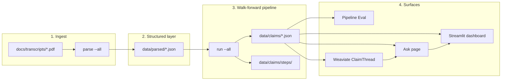
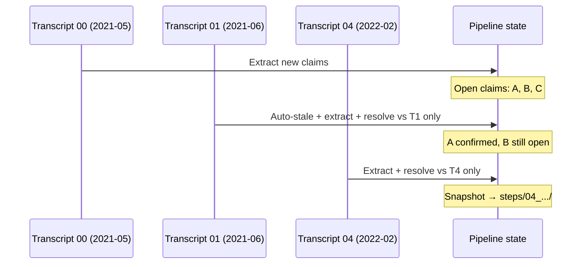
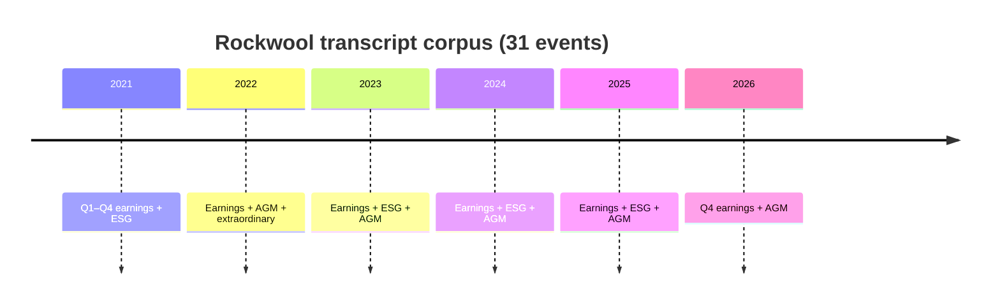
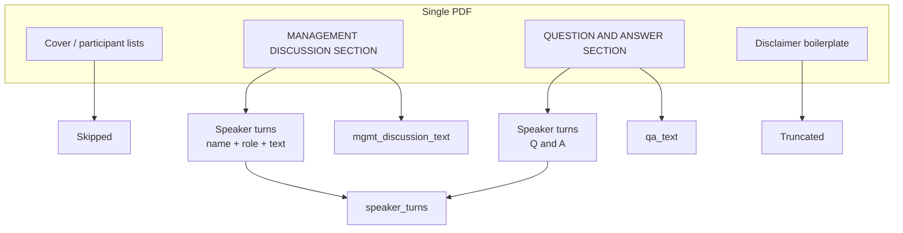
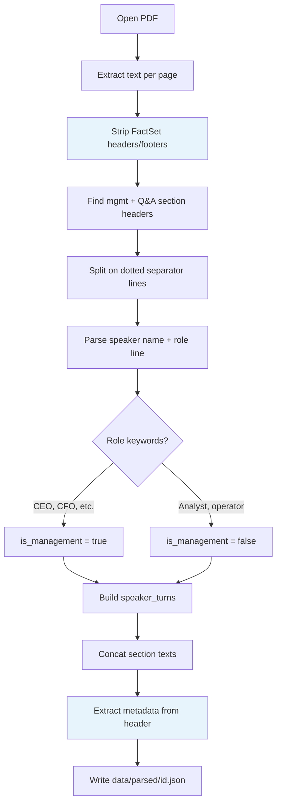
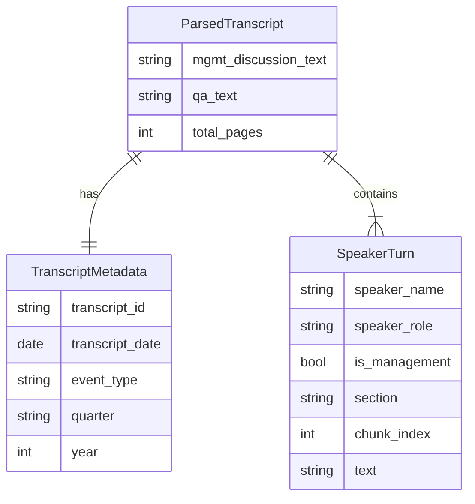
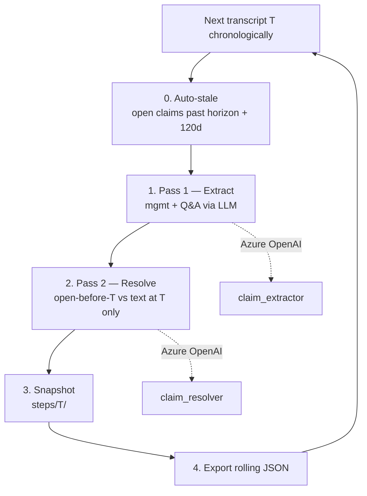
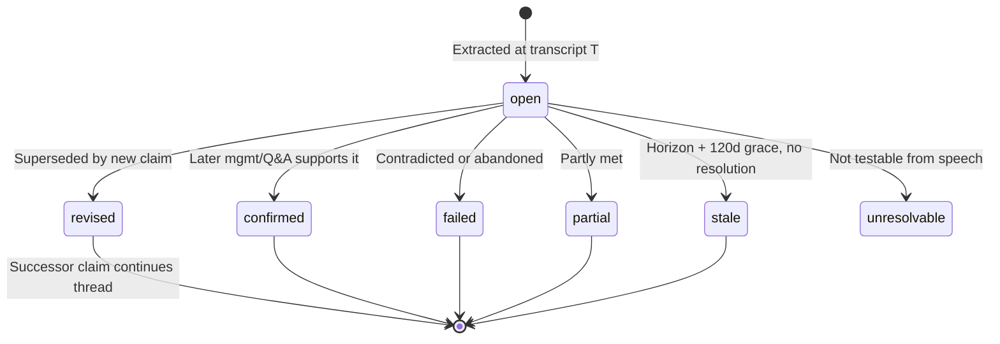
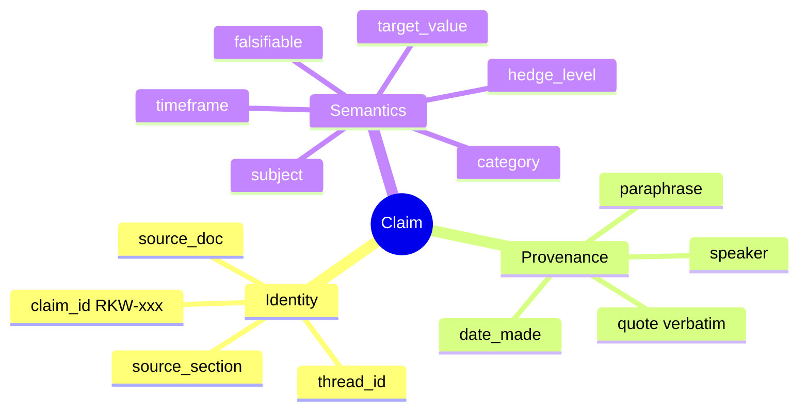
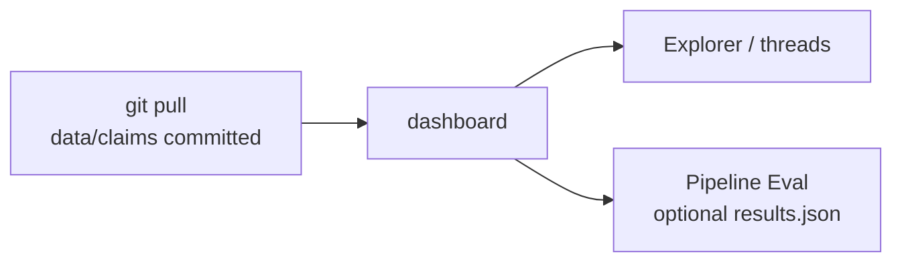

# Data and parsing

How raw FactSet transcripts become structured JSON and a walk-forward claim corpus. For system-wide context see [architecture.md](architecture.md).

---

## End-to-end data flow



| Stage | Command | Output | Who needs it |
|-------|---------|--------|--------------|
| Parse | `parse --all` | `data/parsed/` | Maintainers (once per PDF batch) |
| Pipeline | `run --all` | `data/claims/` | Everyone (committed to git) |
| Ask index | `index-threads --reset` | Weaviate `ClaimThread` vectors | After corpus changes ([architecture.md](architecture.md)) |
| Eval | `eval` | `data/eval/results.json` | Quality / demo ([evaluation.md](evaluation.md)) |

---

## Design thinking

### Why parse PDFs instead of feeding PDFs to the LLM?

| Choice | Rationale |
|--------|-----------|
| **Deterministic parse first** | FactSet PDFs repeat the same layout (sections, dotted separators, headers). Rules + `pdfplumber` give stable speaker turns and verbatim quotes for audit. |
| **JSON as the contract** | Downstream agents read `data/parsed/`, not raw bytes. Re-runs are cheap; prompts can change without re-OCR. |
| **Metadata from PDF body** | Call date and event type come from the FactSet header on each page, not only the filename — filenames are a fallback. |
| **Two section texts + turns** | Full `mgmt_discussion_text` / `qa_text` strings speed LLM context; `speaker_turns[]` preserve attribution for extraction and quote locate. |

### Why JSON for everything in the UI?

| Choice | Rationale |
|--------|-----------|
| **Single source of truth** | `data/claims/` powers Explorer, charts, threads, and eval — no separate search index to keep in sync. |
| **Git-friendly** | Diffs and reviews on claim/resolution changes. |
| **Offline dashboard** | `uv run python -m src.main dashboard` works with only the committed JSON (Azure needed only to re-run the pipeline). |

### Walk-forward discipline

Claims are extracted and resolved **in calendar order**. At transcript *T*, the resolver only sees text from *T* and earlier transcripts in the corpus — no hindsight from later calls. That matches how an analyst would have tracked guidance over time.



---

## Source corpus

| Attribute | Value |
|-----------|--------|
| **Provider** | FactSet CallStreet |
| **Issuer** | Rockwool International (ROCK B / ROCKWOOL A/S) |
| **Events** | 31 transcripts — earnings (Q1–Q4), AGM, ESG, extraordinary |
| **Span** | Q1 2021 → AGM 2026 |
| **On disk** | `docs/transcripts/*.pdf` (local only — not in git) |

**Naming convention:** `{index}_{YYYY-MM-DD}_{event_type}.pdf`  
Example: `07_2022-05-19_earnings_call_Q1.pdf` → `transcript_id` = `07_2022-05-19_earnings_call_Q1`.



---

## Parsing pipeline

### Stack

| Component | Technology | Role |
|-----------|------------|------|
| PDF text | [pdfplumber](https://github.com/jsvine/pdfplumber) | Page-level extraction |
| Structure | Regex + heuristics | Sections, turns, boilerplate |
| Metadata | `transcript_metadata.py` | Date, quarter, event type |
| Schema | Pydantic `ParsedTranscript` | Validated output JSON |
| CLI | `src/main.py parse` | Batch over `docs/transcripts/` |

### FactSet layout (what we target)



### Parse steps (implementation)



| Step | Module | Detail |
|------|--------|--------|
| Page text | `pdf_parser.py` | Per-page extract; remove copyright, page numbers, `1-877-FACTSET`, repeated title lines |
| Sections | `pdf_parser.py` | `MANAGEMENT DISCUSSION SECTION` → `mgmt_discussion`; `QUESTION AND ANSWER SECTION` → `qa` |
| Turns | `pdf_parser.py` | Split on `.{20,}` separator lines; attach name, role, `chunk_index` |
| Management flag | `pdf_parser.py` | Keyword match on role (CEO, CFO, Chairman, …) |
| Disclaimer | `pdf_parser.py` | Cut at *"The information herein is based on"* |
| Metadata | `transcript_metadata.py` | PDF header date/title first; filename regex fallback |

**Run:**

```powershell
uv run python -m src.main parse --all
```

**Outputs:** `data/parsed/<transcript_id>.json` plus `data/stats/parse_summary.json`.

### Parsed document model



**Example (abbreviated):**

```json
{
  "metadata": {
    "transcript_date": "2021-05-20",
    "event_type": "earnings_call",
    "quarter": "Q1",
    "year": 2021
  },
  "speaker_turns": [
    {
      "speaker_name": "Jens Birgersson",
      "speaker_role": "President & Chief Executive Officer, Rockwool International A/S",
      "is_management": true,
      "section": "mgmt_discussion",
      "chunk_index": 1,
      "text": "..."
    }
  ],
  "mgmt_discussion_text": "...",
  "qa_text": "..."
}
```

Eval and quote-locate use the concatenated section texts; the extractor LLM receives formatted turns from the same file.

---

## Walk-forward corpus (`data/claims/`)

### Pipeline passes (per transcript)



```powershell
uv run python -m src.main run --all
uv run python -m src.main rebuild-trace   # optional: refresh thread traces from steps
```

### Directory layout

```text
data/
├── parsed/                          # 31 structured transcripts
│   └── 00_2021-05-20_earnings_call_Q1.json
├── claims/
│   ├── claims_made.json             # all extracted claims
│   ├── claims_with_resolutions.json # + resolution block
│   ├── claims_threads.json          # thematic threads + trace
│   └── steps/
│       └── 04_2022-02-10_earnings_call_Q4/
│           ├── claims_made.json
│           ├── claims_with_resolutions.json
│           └── claims_threads.json
├── eval/
│   ├── gold/                        # hand-curated pilot (00–04)
│   └── results.json                 # latest eval run
└── stats/                           # parse / extraction reports
```

### Claim → resolution lifecycle



| File | Contents |
|------|----------|
| `claims_made.json` | Every claim as extracted (list + corpus metadata) |
| `claims_with_resolutions.json` | Same claims + `resolution` object |
| `claims_threads.json` | `thread_id`, evolution, chronological `trace` |
| `steps/<id>/` | Point-in-time snapshot after that transcript (audit, `rebuild-trace`) |

### Corpus scale (reference)

| Metric | Value |
|--------|-------|
| Transcripts | 31 |
| Claims | 373 |
| Threads | 208 |
| Open | 140 |
| Resolved (non-open) | 233 |
| Confirmed | 75 |

Status definitions: [taxonomy.md](taxonomy.md).

### Claim record (extraction)



### Resolution block

```json
"resolution": {
  "status": "confirmed",
  "resolved_by": ["RKW-010"],
  "evidence_quote": "...",
  "resolution_notes": "...",
  "resolved_at_date": "2022-02-10",
  "resolved_at_transcript": "04_2022-02-10_earnings_call_Q4"
}
```

**Auto-stale:** parseable `timeframe` + **120 days** grace → `stale` if still `open` and never resolved in-corpus.

---

## Teammate workflow



1. Clone repo — `data/claims/` is already populated.
2. `uv run python -m src.main dashboard` → http://localhost:8501  
   (Azure `.env` only needed if you re-run `parse` / `run` / `eval`.)

Maintainers after pipeline changes: commit `data/claims/` → optional `eval`.

---

## Golden-set evaluation (pilot)

Transcripts `00`–`04` only (54 gold claims). See [evaluation.md](evaluation.md).

```powershell
uv run python -m src.main run --limit 5
uv run python -m src.main eval
```

---

## Key code paths

| Path | Responsibility |
|------|----------------|
| `src/ingestion/pdf_parser.py` | PDF → `ParsedTranscript` |
| `src/ingestion/parsed_loader.py` | Load parsed JSON |
| `src/ingestion/transcript_metadata.py` | Header/filename metadata |
| `src/pipeline/orchestrator.py` | Walk-forward loop |
| `src/pipeline/corpus_store.py` | JSON export + steps |
| `src/pipeline/claim_trace.py` | Thread traces from step diffs |
