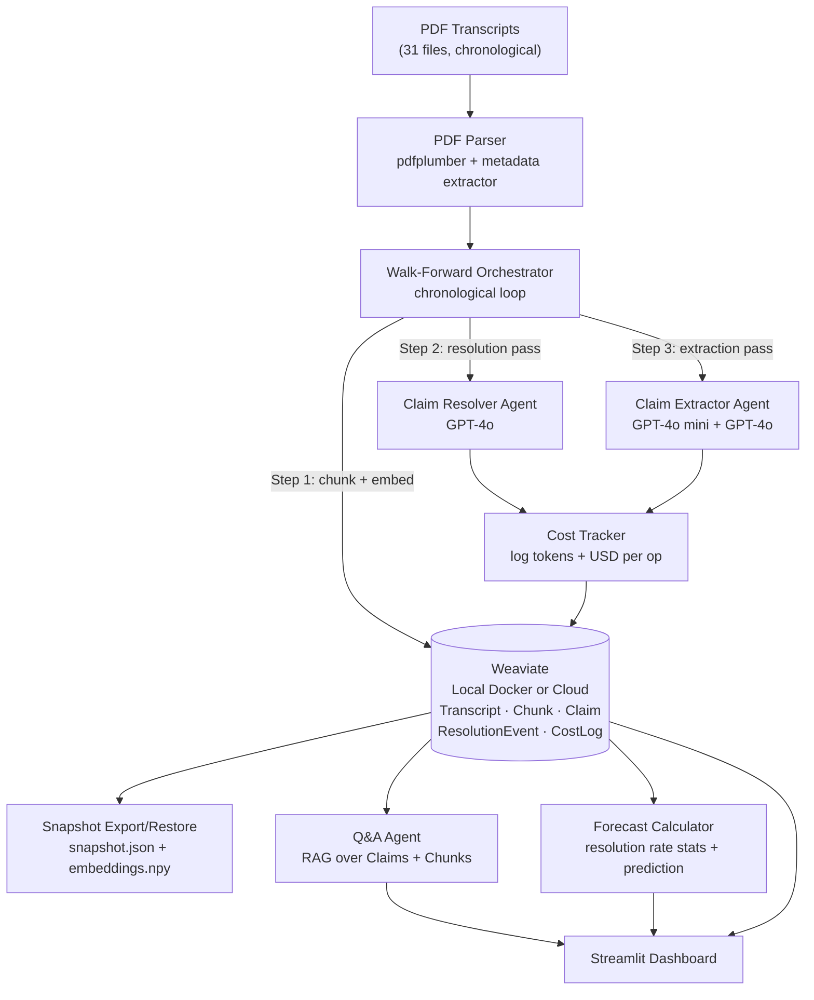
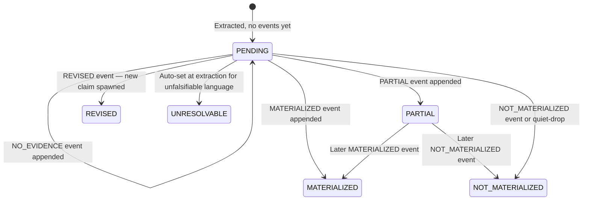

# ClaimWatch: Agent-Based Claim Tracking System

## What We're Building

Three layers:

**1. Processing pipeline** (walk-forward, offline)
Each transcript arrives "live" in chronological order (2021 → 2026). Per transcript: chunk + embed → resolution pass (update PENDING claims) → extraction pass (store new claims).

**2. Query interface** (online, user-facing)
Natural language Q&A over the claims database. User asks a question → vector search Weaviate → GPT-4o formats answer with cited claims and evidence.

**3. Forecast calculator**
Materialization rate analytics by claim type, hedging level, and speaker. Similarity-based prediction for currently PENDING claims based on how similar past claims resolved.

---

## Data Overview

- **31 transcripts** spanning Q1 2021 to Q4 2025 + AGMs + Analyst/ESG meetings
- Format: FactSet CallStreet PDFs — structured as Management Discussion Section + Q&A
- Key speakers: CEO (Jes Munk Hansen), CFO (Kim Junge Andersen)
- Natural chunking boundary: **speaker turns** (each speaker block = one chunk)

---

## Architecture



---

## Weaviate Collections

### `Transcript` (no vector — metadata anchor)
- `id`, `filename`, `date`, `event_type`, `quarter`, `year`, `processed`
- Never searched by vector; used as a reference node

### `TranscriptChunk` (vectorized)
- **Embedded:** chunk text (speaker turn)
- Properties: `transcript_id`, `transcript_date`, `speaker_name`, `speaker_role`, `section` (mgmt_discussion / qa), `chunk_index`, `chunk_text`
- Used for: finding relevant passages when resolving qualitative claims from Q&A

### `Claim` (vectorized)
- **Embedded:** `normalized_claim` (clean one-sentence form)
- Properties: `id`, `transcript_id`, `transcript_date`, `speaker_name`, `speaker_role`, `original_text`, `normalized_claim`, `claim_type`, `claim_subtype` (quantitative / qualitative), `hedging_level`, `time_horizon`, `status` (current derived state)
- For quantitative claims: also stores `metric`, `value`, `unit`, `direction`
- Used for: deduplication on insert, candidate retrieval during resolution

### `ResolutionEvent` (no vector — append-only log)
- `claim_id`, `transcript_id`, `transcript_date`, `verdict` (MATERIALIZED / PARTIAL / NOT_MATERIALIZED / REVISED / NO_EVIDENCE), `evidence_text`, `confidence`, `notes`
- **A claim can have many resolution events** — one per transcript that touches it
- Final claim status is derived from the most recent event

### `CostLog` (no vector — append-only ledger)
- `operation` (pdf_parse / embedding / extraction / resolution / user_query), `transcript_id` (nullable), `model`, `tokens_in`, `tokens_out`, `cost_usd`, `timestamp`
- Enables per-transcript cost breakdown, cumulative cost, and cost-per-claim analytics in the dashboard

---

## Claim Taxonomy

Every claim classified on two axes:

**Type:**
- `financial_guidance` — EBIT%, revenue growth, margins
- `capex_capacity` — factory builds, production lines, land
- `market_outlook` — demand by region, pricing trends
- `strategic_intent` — M&A, product strategy, geographic expansion
- `sustainability` — CO2 targets, electrification milestones
- `operational` — productivity, cost structure, headcount

**Subtype (determines resolution strategy):**
- `quantitative` — has a specific number + metric + horizon → resolved by numeric comparison
- `qualitative` — directional or narrative → resolved by LLM judge

**Hedging level:**
- `hard` — "We commit to / We will"
- `soft` — "We expect / We anticipate / We target"
- `conditional` — "Assuming X, we will..."
- `aspirational` — "We aim / We hope"
- `unfalsifiable` — "We believe in our strategy" → auto-status UNRESOLVABLE, no resolution attempted

---

## Claim Status Machine

Status is **derived** from the ResolutionEvent log, not stored as a single field:



---

## Two Resolution Strategies

### Quantitative claims (e.g. "EBIT margin ~16% for FY2025")
1. Extract structured form at claim time: `{metric: "EBIT margin", value: 16.0, unit: "%", horizon: "FY2025"}`
2. When a new transcript arrives: search for reported actuals in the management section
3. **Numeric comparison** — if actual reported value found, compare directly. No LLM judgment needed for clear matches.
4. Append ResolutionEvent with verdict + evidence quote

### Qualitative claims (e.g. "We will be more global in nature over the coming years")
1. Embed normalized claim
2. When new transcript arrives:
   - For **management discussion section**: send full section as context (only 4-6 pages — worth full context for accuracy)
   - For **Q&A section**: vector search TranscriptChunks (filter by transcript_id + section=qa), retrieve top-3 chunks
3. LLM judge (GPT-4o) reads claim + context → verdict + evidence quote
4. Append ResolutionEvent

---

## Walk-Forward Processing Loop

```
for transcript in sorted(all_transcripts, by=date):
    if transcript.processed:
        continue

    sections = parse_pdf(transcript)          # → {mgmt_discussion, qa, metadata}
    chunks = chunk_by_speaker_turn(sections)
    embed_and_store_chunks(chunks, weaviate)   # TranscriptChunks stored

    # Resolution pass — only looks at claims made BEFORE this transcript
    pending_claims = weaviate.get_pending_claims(before_date=transcript.date)
    for claim in pending_claims:
        event = resolve(claim, transcript, sections, weaviate)
        weaviate.append_resolution_event(event)

    # Extraction pass — new claims from this transcript
    new_claims = extract_claims(sections, transcript)
    for claim in new_claims:
        if not is_duplicate(claim, weaviate):  # cosine > 0.92 + same horizon check
            weaviate.store_claim(claim)

    weaviate.mark_processed(transcript)

# After all transcripts — quiet-drop sweep
flag_expired_claims(weaviate)
```

---

## Key Engineering Decisions

- **Weaviate local Docker by default** — fully offline, no internet dependency during demo; one config line to switch to Weaviate Cloud for hosted deployment
- **No heavy agent frameworks** — direct OpenAI structured outputs (`response_format=BaseModel`) for transparency
- **Two-pass LLM strategy**: `gpt-4o-mini` for bulk extraction, `gpt-4o` for resolution judgment and Q&A
- **Dual resolution strategies**: numeric comparison for quantitative claims, LLM judge for qualitative
- **Full management section context** for qualitative resolution (not just top-K chunks) — it's short enough
- **ResolutionEvent as append-only log** — full timeline per claim, not a single status field
- **Idempotent** — `processed=True` flag; re-runs skip completed transcripts safely
- **Embeddings**: `text-embedding-3-small` via OpenAI, stored natively in Weaviate
- **Cost tracking on every LLM + embedding call** — logged to `CostLog` collection; surfaced in dashboard

---

## File Structure

```
claimwatch/
├── src/
│   ├── ingestion/
│   │   ├── pdf_parser.py           # pdfplumber: splits mgmt section vs Q&A, speaker turns
│   │   └── transcript_metadata.py  # date/type/quarter from filename + content
│   ├── agents/
│   │   ├── claim_extractor.py      # GPT-4o structured output, dual quantitative/qualitative path
│   │   ├── claim_resolver.py       # numeric comparison + LLM judge, appends ResolutionEvents
│   │   └── query_agent.py          # RAG Q&A: vector search Claims/Chunks → GPT-4o answer
│   ├── store/
│   │   ├── weaviate_client.py      # connection (local Docker or Cloud via .env)
│   │   └── weaviate_ops.py         # get_pending_claims, store_claim, append_event, mark_processed
│   ├── analytics/
│   │   ├── cost_tracker.py         # wraps every OpenAI call, logs to CostLog collection
│   │   └── forecast.py             # materialization rates, similarity-based prediction
│   ├── snapshot.py                 # export all data → snapshot.json + embeddings.npy; restore cmd
│   ├── models/
│   │   └── schema.py               # Pydantic models: Claim, TranscriptChunk, ResolutionEvent, CostLog
│   ├── orchestrator.py             # Walk-forward loop
│   └── main.py                     # CLI: run / restore / status / reset
├── app/
│   └── dashboard.py                # Streamlit UI (all panels)
├── data/
│   ├── snapshot.json               # committed — pre-built claims + resolution events
│   ├── embeddings.npy              # committed — pre-computed vectors (~12MB)
│   └── weaviate/                   # gitignored — live Weaviate storage
├── docker-compose.yml              # Weaviate local setup
├── requirements.txt
└── .env.example                    # OPENAI_API_KEY, WEAVIATE_MODE=local|cloud, WEAVIATE_URL, WEAVIATE_API_KEY
```

---

## Natural Language Q&A Interface

User asks: *"Which claims about North America margins were made and how did they resolve?"*

```
1. Embed the question → vector search Claim collection → top-5 relevant claims
2. For each claim, fetch its ResolutionEvent log
3. GPT-4o formats a structured answer with claim quotes + resolution evidence + transcript citations
4. Cost logged to CostLog
```

Users can also ask: *"Show me all claims Jes made about factory expansions that didn't materialize"* — hybrid filter (speaker=Jes, type=capex_capacity, status=NOT_MATERIALIZED) + semantic search.

---

## Forecast Calculator

**Historical stats panel:**
- Materialization rate by claim type (e.g., "Financial Guidance: 72% materialize, avg 2.3 quarters to resolve")
- Materialization rate by hedging level (hard > soft > aspirational — validates the taxonomy)
- Speaker accuracy: CEO vs CFO hit rates
- Trend over time: is management guidance getting more/less accurate?

**Pending claim prediction:**
For each PENDING claim, find the top-5 most similar *resolved* claims by vector search → weighted average of their verdicts → probability score:

```
Pending claim: "We expect EBIT of ~17% for FY2026"
Similar resolved claims:
  "~16% EBIT for FY2025" → MATERIALIZED (actual: 16.2%)   sim: 0.94
  "~15% EBIT for FY2024" → MATERIALIZED (actual: 17.5%)   sim: 0.91
  "~14% EBIT for FY2023" → PARTIAL (actual: 13.2%)        sim: 0.88
Prediction: 67% probability MATERIALIZED
```

---

## Cost Tracking

Every OpenAI call is wrapped by `cost_tracker.py`:

```python
# Pricing constants (updated per model)
COSTS = {
    "gpt-4o":            {"input": 2.50, "output": 10.00},   # per 1M tokens
    "gpt-4o-mini":       {"input": 0.15, "output":  0.60},
    "text-embedding-3-small": {"input": 0.02}
}
```

**Dashboard cost panel shows:**
- Total spend to date
- Cost per transcript (processing)
- Cost breakdown: embedding vs extraction vs resolution vs user queries
- Cost per claim extracted, cost per resolution

---

## Streamlit Dashboard — Full UI Spec

Multi-page app with sidebar navigation:

```
🏠  Overview
🔍  Claims Explorer
💬  Ask Questions
📈  Forecast & Analytics
💰  Cost Tracker
✅  Evaluation
```

---

### 🏠 Overview (landing page)
- Pipeline status bar — X/31 transcripts processed, last run date
- 5 stat cards — Total Claims | Materialized | Partial | Not Materialized | Pending
- Claim status donut chart (proportion by status)
- Recent resolution events feed — last 5 resolutions with claim snippet + verdict badge
- Timeline sparkline — claims made per quarter (2021 → 2026), colored by eventual status
- Cost to date badge (top right)

---

### 🔍 Claims Explorer
Left sidebar filters: claim type, status, hedging level, speaker, time horizon year, date range

Main panel — sortable interactive table (st.dataframe with column_config):
- Date | Speaker | Claim (truncated) | Type | Hedging | Horizon | Status | # Events

Click any row → **Claim Detail drawer** opens on right:
- Verbatim original quote in transcript context
- Normalized claim + structured fields (quantitative: metric / value / unit)
- Type + hedging badges
- **Resolution Timeline** (most important UI element):
  ```
  Q1 2025  [NO_EVIDENCE]       "No explicit mention of EBIT target this call"
  Q2 2025  [PARTIAL]    0.65   "Tracking toward guidance, Q2 EBIT at 15.8%..."
  Q4 2025  [MATERIALIZED] 0.92 "Full year EBIT reported at 16.2%..." → [view in transcript]
  ```
- Similar claims panel (top-3 by vector similarity)

---

### 💬 Ask Questions (RAG interface)
- Suggested question chips at top:
  - "Which EBIT guidance claims weren't met?"
  - "What did management say about North America expansion?"
  - "Show me all factory build claims and their outcomes"
- Free-text input box
- Response: answer paragraph + expandable cited claim cards (claim text, status badge, transcript source)
- Cost badge per query: "This query cost $0.003"

---

### 📈 Forecast & Analytics

Tab 1 — Historical Performance:
- Materialization rate by claim type (horizontal bar chart)
- Materialization rate by hedging level — validates taxonomy (hard > soft > aspirational)
- Time-to-resolution histogram (in quarters)
- CEO vs CFO accuracy comparison
- Year-over-year guidance accuracy trend

Tab 2 — Pending Predictions:
- Table of all PENDING claims
- For each: predicted materialization probability + top-3 similar resolved claims used to compute it
- Expandable: shows which past claims drove the prediction and their outcomes

---

### 💰 Cost Tracker
- Total spend hero stat
- Breakdown bar: Embedding | Extraction | Resolution | User Queries
- Per-transcript cost table (sortable)
- Cost per claim extracted, cost per resolution event
- Cumulative spend over time line chart

---

### ✅ Evaluation
- Consistency check results: pass/fail list with explanations for any failures
- Taxonomy validation chart: hedging level vs actual materialization rate
- Gold set metrics (precision / recall / resolution accuracy)
- Inter-model agreement score (Claude-as-judge)
- Failure mode examples — annotated cases showing where and why the system got it wrong

---

### Visual Language
- Status colors: green (MATERIALIZED), amber (PARTIAL), red (NOT_MATERIALIZED), blue (PENDING), gray (UNRESOLVABLE)
- Plotly for all interactive charts
- Claim cards with colored left border by status
- Transcript citations as st.expander blocks

---

## Snapshot Export / Restore

After running the full pipeline once, export everything for zero-setup demo sharing:

```bash
python -m src.main export    # → data/snapshot.json + data/embeddings.npy (~12MB total)
python -m src.main restore   # → seeds fresh Weaviate from snapshot in seconds, no API key needed
```

**Interviewer setup (no API key, no waiting):**
```bash
git clone https://github.com/you/claimwatch
docker-compose up -d          # starts Weaviate locally
python -m src.main restore    # loads snapshot
streamlit run app/dashboard.py
```

---

## Deployment Options

### Local (development + screen-share demo)
- Weaviate: local Docker (`docker-compose up -d`)
- App: `streamlit run app/dashboard.py`
- Fully offline, no internet dependency, no credentials needed for the demo itself

### Hosted (share with interviewers post-call) — all free
| Component | Service | Cost |
|---|---|---|
| Dashboard | Streamlit Community Cloud | Free forever |
| Vector DB | Weaviate Cloud Serverless | Free tier |
| LLM (user queries) | OpenAI API | ~$0.01 per question (pay-per-use) |

**Hosted setup steps:**
1. Push repo to public GitHub (snapshot committed)
2. Create Weaviate Cloud account → free serverless cluster → note URL + API key
3. Run `python -m src.main restore --target cloud` once → seeds Weaviate Cloud from snapshot (no re-processing needed)
4. Connect Streamlit Community Cloud to GitHub repo → add secrets: `WEAVIATE_URL`, `WEAVIATE_API_KEY`, `OPENAI_API_KEY`
5. Share URL: `https://claimwatch.streamlit.app`

### Switching between local and cloud
Purely a `.env` change — no code differences:
```
WEAVIATE_MODE=local    # → connect_to_local()
WEAVIATE_MODE=cloud    # → connect_to_weaviate_cloud(url, api_key)
```

### Alternative: Hugging Face Spaces
- Free, 2 CPU + 16GB RAM — more powerful than Streamlit Community Cloud
- Can run Weaviate Embedded in-process (no separate cloud DB)
- Downside: Embedded Weaviate loses data on container restart → seeds from snapshot on cold start (~30s delay)
- URL: `https://huggingface.co/spaces/you/claimwatch`

---

## Scalability Path (no code rewrite needed)

- **31 docs** → local Docker, sequential loop, sync LLM calls
- **30k docs** → Weaviate Cloud scale tier, async batch processing, queue-based orchestration
- **3M docs** → Weaviate distributed + sharding by company/corpus, topic-routing agents, streaming ingestion

The abstractions (`weaviate_ops.py`, `claim_extractor.py`, `claim_resolver.py`, `cost_tracker.py`) don't change — only infrastructure config does.

---

## Evaluation Strategy

Evaluation is **phased and iterative** — not a one-shot audit after all 31 docs. Quality must be validated before scaling, because extraction errors in early transcripts propagate spurious resolution events through all subsequent ones.

---

### Phase 1: Prompt development (docs 1-3 only)

Run extraction on first 3 transcripts. Manually inspect **every output**:
- Are the right claims extracted? Any missed? Any false positives?
- Are claim type, hedging level, and time horizon correct?
- Are verbatim quotes accurate?

Iterate on prompts until satisfied. This is not evaluation — it is prompt engineering with a human in the loop.

**Gate:** proceed only when manual inspection passes on all 3 transcripts.

---

### Phase 2: Resolution validation (docs 4-6)

Test the resolver against new transcripts. Manually verify:
- Are PENDING claims from Phase 1 being resolved correctly?
- Is evidence text accurate and actually present in the source transcript?
- Are confidence scores calibrated to actual correctness?

Fix prompt issues before continuing.

**Gate:** proceed only when resolution verdict accuracy is acceptable on spot-check.

---

### Phase 3: Small-scale end-to-end test (docs 1-10)

Run full walk-forward loop on first 10 transcripts. At the end:
- Run all automated consistency checks (see below)
- Spot-check 10 resolution events manually
- Read the claim timeline — does it tell a coherent narrative?

**Gate:** proceed to full pipeline only if consistency checks pass and spot-check is clean.

---

### Phase 4: Full pipeline (all 31 docs)

Run with confidence. Post-run:
- Automated consistency checks on entire dataset
- LLM-as-judge (Claude evaluates GPT-4o output) on a sample of ~30 claims
- Quantitative metrics on manual gold set
- Failure categorisation

---

### Automated Consistency Checks (run after every phase)

These are cheap, catch bugs without manual labeling, and run automatically:

- Resolution transcript date is always **after** claim transcript date (no time leakage)
- Every MATERIALIZED / PARTIAL / NOT_MATERIALIZED verdict has non-empty evidence text
- No claim has a resolution event from its own source transcript
- REVISED claims have a linked successor claim in DB
- Quiet-dropped claims have an expired, parseable time horizon (not vague like "medium term")
- No two claims in DB have cosine similarity > 0.95 with the same time horizon (deduplication check)

---

### Quantitative Metrics (on manual gold set — ~45 claims across 3 transcripts)

- **Extraction Precision** — of what we extracted, what % are legitimate forward-looking management claims?
- **Extraction Recall** — of real claims in those transcripts, what % did we catch?
- **Resolution Accuracy** — of gold-labeled resolutions, what % match system verdict?
- **Confidence Calibration** — when `confidence=0.9`, are we right ~90% of the time?
- **Inter-model Agreement** — Claude-as-judge agreement rate with GPT-4o resolution verdicts

---

### Taxonomy Validation

- Does hedging level predict materialization rate? (`hard` > `soft` > `aspirational`)
- If not, the taxonomy isn't capturing real signal and needs revision
- This is a key thing to discuss in the screen share

---

### CLI Support for Phased Evaluation

```bash
python -m src.main run --limit 3        # Phase 1: extraction dev
python -m src.main run --limit 10       # Phase 3: end-to-end test
python -m src.main run                  # Phase 4: full pipeline
python -m src.main inspect --transcript "Q1 2021"   # dump all claims + events for manual review
python -m src.main check                # run all consistency checks and print report
```

---

### Known Failure Modes (for screen share discussion)

- **Vague time horizons** — "over the medium term" cannot be resolved; quiet-drop timing is arbitrary
- **Implied revisions** — management stops mentioning a claim without explicitly retracting it; silence ≠ signal
- **Compound claims** — "revenue growth AND margin expansion AND €450M CapEx" — partial resolution if one leg fails
- **Analyst paraphrase** — analysts restate management claims as questions; risk of misattribution
- **Boilerplate false positives** — legal disclaimer language can look like forward-looking statements
- **Self-consistency bias** — same model family extracts and resolves; may favour its own framing

---

## Discussion Prep (for the 1-hour screen share)

- **Taxonomy rationale**: why unfalsifiable claims are tagged at extraction, not evaluated
- **Dual resolution strategies**: why numeric comparison is more reliable than LLM judgment for quantitative claims
- **Resolution timeline**: why a single status field is wrong; what the ResolutionEvent log reveals about management behaviour (revisions, quiet drops)
- **Failure modes**: vague horizons ("medium term"), implied revisions (vs explicit), compound claims, false positives from similar-but-different metrics
- **Scaling discussion**: Weaviate's role at each scale tier; where the bottleneck shifts from LLM cost to ingestion throughput
